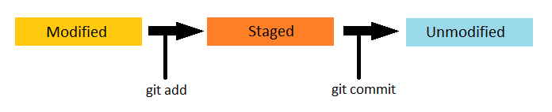
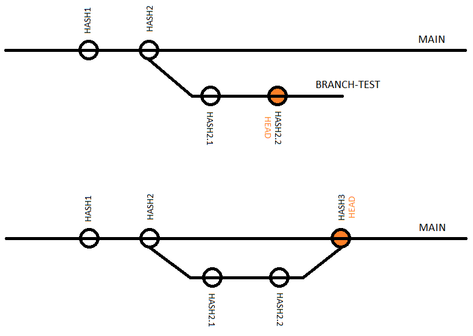
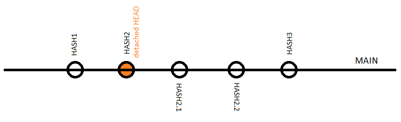

## GIT life cycle

Importante ter uma noção do ciclo de versionamento do git:

***

* **Untracked** - arquivo novo e ainda não rastreado pelo repositório git.
* **Unmodified** - estado padrão dos arquivos rastreados pelo repositório git, quando não há modificações.
* **Modified** - arquivos que foram modificados desde o último *commit*.
* **Staged** - arquivos prontos para serem adicionados ao próximo *commit*.

## Comandos básicos

* `git status` - inspeciona o repositório e retorna informações relevantes (estado dos arquivos, branch atual e remota, etc.)

***

* `git log` - retorna o histórico de commits com informações relevantes sobre cada um (hash, autor, descrição, etc.).
  * `git log --oneline` - retorna o histórico apenas com hash simplificado e descrição de cada commit.
  * *`git log --graph` - retorna o histórico com uma representação gráfica das branchs.*

***

* `git add` - muda o estado dos arquivos de *modified* para *staged*
  * `git add .` - adiciona todos os arquivos a partir do seu diretório atual.
  * `git add -A` - adiciona **todos** os arquivos.
  * *`git add <file>` - adiciona apenas o arquivo indicado.*
  * *`git add <path>` - adiciona todos os arquivos a partir do caminho indicado.*

***

* `git rm --cached` - muda o estado dos arquivos de *staged* para *modified* ou *untracked* (reverte o comando `git add`).
  * `git rm --cached <file>` - reverte apenas o arquivo indicado.
  * `git rm --cached -- <file1> <file2> <file3>` - reverte apenas os arquivos indicados.
  * *`git rm --cached -r <path>` - reverte todos os arquivos a partir do caminho indicado.*
  * *`git rm --cached -r .` - reverte todos os arquivos a partir do seu diretório atual.*

***

* `git commit -m "some comment/description"` - muda o estado dos arquivos de *modified* para *staged* (incluindo todos ao repositório git.)

***

* `git push` - atualiza o repositório remoto com as alterações do repositório local.
  * `git push -u origin <branch>` ou `git push --set-upstream origin <branch>` - cria uma associação entre a branch local e a branch remota.

***

* `git fetch` - baixa atualizações do repositório remoto sem realizar o merge (não altera o estado de trabalho do repositório local)

***

* *`git merge <branch>` - realiza o merge entre a branch indicada e a branch atual (HEAD).*
  * *`git merge --no-ff <branch>` - realiza o merge e gere um commit referente ao merge.*

***

* `git pull` - baixa atualizações do repositório remoto e realiza o merge na branch atual (HEAD). (atalho para os comandos `git fetch` e `git merge`)
  * `git pull origin <branch>` - realiza o merge da branch indicada.

***

Representação gráfica do fluxo de trabalho de um repositório git:

## Comandos para trabalhar com branchs

Mas antes precisamos entender o **HEAD**:

***

* `git branch` ou *`git branch --list`* - exibe todas as branchs locais.
  * `git branch -d <branch>` - deleta a branch indicada.
  * *`git branch -r` - exibe somente as branchs remotas.*
  * *`git branch -a` - exibe **todas** as branchs.*
  * *`git branch <branch-name>` - cria uma nova branch com o nome indicado a partir da branch atual (HEAD).*
  * *`git branch <branch-name> <base-branch>` - cria uma nova branch com o nome indicado a partir da branch indicada.*
  * *`git branch -m <branch-name>` - renomeia a branch atual (HEAD) com o nome indicado.*

***

* *`git checkout <branch>` - aponta o HEAD para a branch indicada.*
  * *`git checkout <commit-hash>` - aponta o HEAD (detached HEAD) para um commit.*
  * *`git checkout -b <branch-name＞` - cria uma nova branch com o nome indicado a partir da branch atual (HEAD) e aponta o HEAD para a branch criada. (atalho para os comandos `git branch <branch-name>` e `git checkout <branch>`).*
  * *`git checkout -b <branch-name＞ <base-branch>` - cria uma nova branch com o nome indicado a partir da branch indicada e aponta o HEAD para a branch criada. (atalho para os comandos `git branch <branch-name> <base-branch>` e `git checkout <branch>`).*

***

* `git switch <branch>` - aponta o HEAD para a branch indicada.
  * `git switch -c <branch-name>` - cria uma nova branch com o nome indicado a partir da branch atual (HEAD) e aponta o HEAD para a branch criada. (atalho para os comandos `git branch <branch-name>` e `git switch <branch>`).
  * *`git switch -c <branch-name> <base-branch>` - cria uma nova branch com o nome indicado a partir da branch indicada e aponta o HEAD para a branch criada. (atalho para os comandos `git branch <branch-name> <base-branch>` e `git switch <branch>`).*

***

Exemplo gráfico da utilização de branchs:

## References

git reference manual: **https://git-scm.com/docs**

Atlassian tutorial: **https://www.atlassian.com/br/git/tutorials**